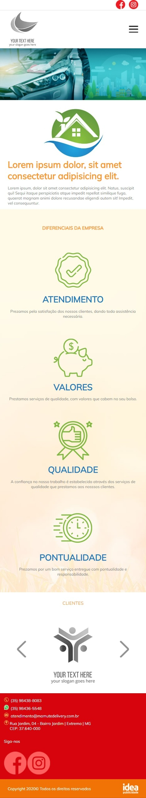

<h1 align="center"> Eco Lavagem Delivery </h1>

Projeto desenvolvido como 2ª etapa do processo seletivo para a vaga de estágio de web design da Idea Publicidade.

  <a href="#-tecnologias">Tecnologias</a>&nbsp;&nbsp;&nbsp;|&nbsp;&nbsp;&nbsp;
  <a href="#-projeto">Projeto</a>

 

  

  
  

## 🚀 Tecnologias

Esse projeto foi desenvolvido com as seguintes tecnologias:

- HTML e CSS
- JavaScript

## 💻 Projeto

Página home de uma empresa especializada em lavagem delivery.

---

Feito com ♥ por Paula Marinho :wave:
